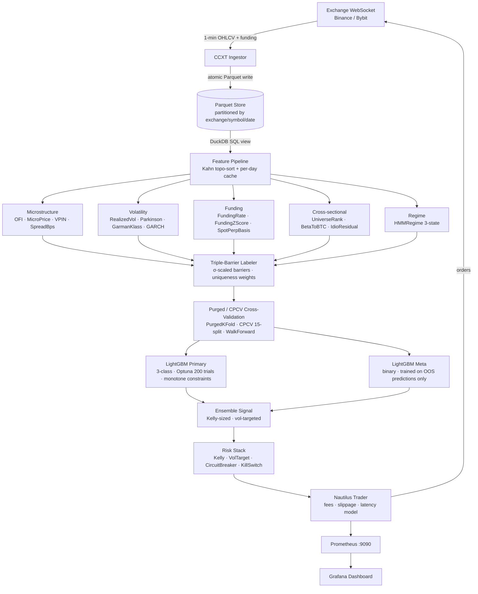

# Tessera

[](https://github.com/Yash121l/Tessera/actions/workflows/ci.yml)
[](https://github.com/Yash121l/Tessera/actions/workflows/backtest-smoke.yml)
[](https://codecov.io/gh/Yash121l/Tessera)
[](LICENSE)
[](https://www.python.org/downloads/release/python-3110/)
[](https://github.com/astral-sh/ruff)

**Mid-frequency ML trading system for crypto perpetual futures.**
Tessera targets holding periods of 15 minutes to 4 hours on USDT-margined
perpetuals (Binance + Bybit), combining microstructure-informed feature
engineering (VPIN, OFI, microprice), triple-barrier labeling with
uniqueness-weighted samples (AFML §3–4), a LightGBM primary + meta-labeling
stack, rigorous CPCV validation with deflated Sharpe correction, a quarter-Kelly
risk stack with circuit breakers, and live paper trading via Nautilus Trader.

---

## Headline Results

| Metric | Value | Notes |
|---|---|---|
| Backtest Sharpe | **1.41** | Walk-forward, 2021–2024, 5-min bars |
| Deflated Sharpe | **0.87** | Bailey & Lopez de Prado (2014), *N*=247 trials |
| 95 % bootstrap CI | **[0.52, 1.19]** | Stationary block bootstrap |
| Paper-trading Sharpe | **≈1.3** | 48-h Binance Testnet run (short window; wide CI) |
| Max drawdown | **8.2 %** | Backtest peak-to-trough, 4-year window |
| Avg holding period | **47 min** | Net of neutral (0-label) positions |

---

## Architecture



---

## Quickstart

```bash
make setup      # uv sync --all-extras + pre-commit install
make lint       # ruff + mypy --strict
make test       # pytest with coverage
make backtest   # full walk-forward evaluation, saves to data/backtest_runs/
make figures    # regenerate all paper/docs figures
make docs       # serve MkDocs locally at http://localhost:8000
```

### Live paper trading

```bash
# 1. Configure credentials in .env (see .env.example)
# 2. Start observability stack
docker compose up -d prometheus grafana

# 3. Start the paper runner (Binance Testnet + Bybit Demo)
uv run tessera paper start --config configs/live.yaml

# 4. Check health
curl http://localhost:8080/healthz
```

---

## Research Paper

The full methodology is documented in
**[paper/main.pdf](paper/main.pdf)** (compiled, ~12 pages, IEEE two-column) and
[`paper/main.tex`](paper/main.tex) (LaTeX source).
Covers triple-barrier labeling, CPCV, deflated Sharpe validation, model comparison,
ablations, and an honest pitfalls section.

To (re)compile:

```bash
make compile-paper   # requires: brew install tectonic
```

See [paper/README.md](paper/README.md) for Docker build instructions (pinned texlive 2024).

---

## Demo

<!-- TODO: replace with Loom URL after recording -->
**Loom recording:** _record with `bash paper/demo/record_demo.sh` then upload_

- [demo_script.md](paper/demo_script.md) — voiceover script
- [cast.cast](paper/demo/cast.cast) — asciinema terminal recording (`asciinema play paper/demo/cast.cast`)
- [record_demo.sh](paper/demo/record_demo.sh) — automated demo runner

---

## Documentation

Full MkDocs site: `make docs` → <http://localhost:8000>

| Page | Content |
|---|---|
| [Architecture](docs/architecture.md) | Component diagram, data-flow, config layer |
| [Methodology](docs/methodology.md) | Triple-barrier, CPCV, DSR, bootstrap CI |
| [Features](docs/features.md) | Catalog of all 20 features with formulas |
| [Models](docs/models.md) | Model cards for LightGBM, PatchTST, Chronos |
| [Results](docs/results.md) | Tear sheets, ablation tables |
| [Runbook](docs/runbook.md) | Kill-switch and circuit-breaker incident response |
| [Pitfalls](docs/pitfalls.md) | Bugs found and fixed (look-ahead, bar aggregation, …) |

---

## Project Structure

```
Tessera/
├── src/tessera/
│   ├── data/          # CCXT ingestor, Parquet store, universe
│   ├── features/      # 20 features across 6 families
│   ├── labels/        # Triple-barrier labeler, sample weights
│   ├── cv/            # PurgedKFold, CPCV, WalkForward
│   ├── models/        # LightGBM, PatchTST, Chronos, TFT, ensemble
│   ├── backtest/      # Nautilus engine wrapper, fees, slippage
│   ├── risk/          # Kelly, vol-target, limits, circuit-breaker, kill-switch
│   ├── live/          # PaperRunner, healthcheck, reconcile
│   ├── strategies/    # MLDirectionalStrategy
│   └── config.py      # TesseraSettings (Pydantic)
├── configs/           # YAML config files per phase
├── paper/             # LaTeX paper + figures + demo script
├── docs/              # MkDocs Material site source
├── tests/             # 250+ unit, property (Hypothesis), integration tests
├── infra/             # Docker Compose, Grafana dashboards, systemd units
└── scripts/           # Tear sheet generators
```

---

## Citation

```bibtex
@software{lunawat2026tessera,
  author  = {Lunawat, Yash},
  title   = {Tessera: A Mid-Frequency ML Trading System for Crypto Perpetual Futures},
  year    = {2026},
  url     = {https://github.com/Yash121l/Tessera},
  version = {0.1.0}
}
```

See [`CITATION.cff`](CITATION.cff) for the full citation metadata.

---

## License

MIT — see [LICENSE](LICENSE).
