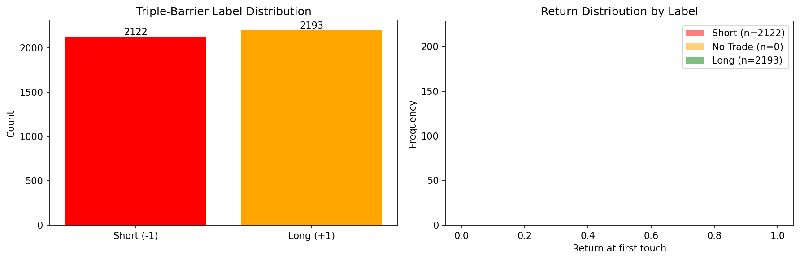

# Research Methodology

## Triple-Barrier Labeling (AFML §3)

Standard fixed-horizon returns create noisy labels because they ignore the
path taken by prices. The triple-barrier method assigns labels based on
which of three barriers is touched first:

```
                  ┌─── Upper barrier (profit-take): entry × (1 + pt × σ)
                  │
    Price ───────►├─── Vertical barrier (time expiry): t₀ + Δt
                  │
                  └─── Lower barrier (stop-loss):  entry × (1 - sl × σ)
```

- **Upper hit first → +1 (long)**: price moved up enough to take profit.
- **Lower hit first → -1 (short)**: price moved down past the stop.
- **Vertical hit → 0 (no trade)**: price didn't move enough.

### Volatility scaling (§3.1)

Barriers are scaled by local volatility σ computed as the exponentially
weighted standard deviation of log returns:

    σ_t = EWM_std(ln(p_t / p_{t-1}), span=S)

This makes labels adaptive: the same event in a calm vs. volatile market
gets differently-sized barriers.

### Meta-labeling (§3.6)

A secondary model predicts whether the primary model's *direction* was
correct (binary: 0 or 1), rather than predicting direction itself. This
separates the "when to trade" question from "which direction", and allows
the meta-model to focus on sizing and filtering.



## Sample Weights (AFML §4)

Labels with overlapping time windows share information. If label A spans
bars 10–20 and label B spans bars 15–25, training on both gives redundant
signal. The sample weighting scheme:

1. **Concurrency (§4.2)**: Count how many label windows overlap each bar.
2. **Uniqueness**: Each event's weight is inversely proportional to the
   average concurrency over its window.
3. **Return-weighted (§4.4)**: Scale by absolute return over the window —
   large moves are more informative.
4. **Time decay (§4.10)**: Optionally down-weight older samples.

## Purged K-Fold Cross-Validation (AFML §7.4)

Standard k-fold CV leaks information in financial data because labels have
overlapping time windows that span across folds:

```
  Fold 1 (train)    │ Fold 2 (test)     │ Fold 3 (train)
  ─────────────────►│──────────────────►│────────────────►
       ┌──── Label A ────┐                      Time →
             Window spans into test fold!
```

**PurgedKFold** fixes this by:

1. **Purging**: Any training sample whose label window [t₀, t₁] overlaps
   the test fold's time range is removed from training.
2. **Embargo**: An additional buffer of `pct_embargo × N` samples after
   each test fold is also excluded, guarding against serial correlation
   in residuals.

### sklearn CV traps this code avoids

| Trap | Standard KFold | PurgedKFold |
|------|---------------|-------------|
| Label leakage via overlapping windows | Yes — labels spanning fold boundaries leak test info | Purged — overlapping samples removed |
| Serial correlation after test fold | Yes — adjacent bars are correlated | Embargo period excludes post-test samples |
| Non-IID assumption | Assumes IID samples | Accounts for temporal dependence |
| Survivorship bias in time series | Shuffles time order | Preserves chronological order |
| Redundant samples dominating | Equal weight | Pairs with concurrency-based weighting |

## Combinatorial Purged K-Fold (AFML §12)

Standard purged k-fold produces N backtest paths (one per fold). CPCV
generates C(N, k) splits by designating k out of N folds as test in each
combination, producing C(N−1, k−1) independent backtest paths.

For the default (N=6, k=2):
- **15 splits** = C(6, 2)
- **5 backtest paths** = C(5, 1)

Each path is a complete walk through the data using only out-of-sample
predictions. The distribution of path-level Sharpe ratios feeds into the
deflated Sharpe ratio test (Bailey & Lopez de Prado, 2014), which adjusts
for multiple testing.

## Walk-Forward Validation

For non-overlapping features or as a simpler baseline:

- **Expanding window**: Train on [0, t), test on [t, t+Δ), advance by step.
  Training set grows over time.
- **Rolling window**: Train on [t-W, t), test on [t, t+Δ). Fixed-size
  training window slides forward.

## Probabilistic Sharpe Ratio (PSR)

The naive Sharpe ratio is an estimator, not the true population ratio.  For a
return series of length T with skewness γ₃ and excess kurtosis γ₄:

```
Var(SR̂) ≈ [1 − γ₃·SR̂_p + (γ₄+2)/4·SR̂_p²] / (T−1)
```

where SR̂_p = SR̂_annual / √ann is the per-period ratio.

**PSR(SR₀) = Φ[(SR̂_p − SR₀_p) / √Var(SR̂_p)]**

This gives the probability that the *true* population Sharpe exceeds a
benchmark SR₀ (usually 0) given the sample evidence.

Two corrections distinguish PSR from the plain z-test:

| Source of uncertainty | Standard Sharpe | PSR |
|-----------------------|-----------------|-----|
| Estimation noise | Ignored | Accounted via T |
| Non-normal returns (fat tails, skew) | Ignored | Accounted via γ₃, γ₄ |

### Interpretation
- PSR < 0.75: weak evidence — could easily be a lucky run.
- PSR 0.75–0.95: moderate evidence — worth more data.
- PSR ≥ 0.95: strong evidence — deploy-ready under stable conditions.

---

## Deflated Sharpe Ratio (DSR)

When N strategies or hyperparameter configurations are tested, the best
observed SR is inflated by selection bias.  Bailey & López de Prado (2014)
correct for this by raising the benchmark to the *expected maximum SR under
H₀* (no skill):

```
SR* = σ_SR × [(1−γ_em)·Φ⁻¹(1−1/N) + γ_em·Φ⁻¹(1−1/(N·e))]
```

where γ_em = 0.5772… (Euler-Mascheroni) and σ_SR is the standard deviation
of SRs across the N independent trials.

**DSR = PSR(observed_sr, SR*, T, γ₃, γ₄)**

DSR answers: "if N random configs were tested with no skill, how often would
we see an SR this high by luck alone?" A DSR of 0.95 means only a 5% chance
the result is pure luck.

### Trial count — what must be included

Every model selection decision inflates the apparent SR:

| Source | Count as trials |
|--------|----------------|
| Optuna hyperparameter search | Each completed trial |
| Manual notebook grid searches | Each configuration run |
| Ablation variants (latency × slippage) | Each variant |
| Architecture decisions (primary vs. meta vs. ensemble) | Each model type evaluated |

Use `compute_trial_count(optuna_study, manual_configs)` to aggregate all
sources.  Undercounting N makes DSR look better than it is.

### Example
With SR = 2.0, T = 252, N = 180 trials, σ_SR = 0.5:

- SR* ≈ 0.5 × 2.37 ≈ 1.19 (expected lucky max)
- DSR = PSR(2.0, 1.19, 252) ≈ 0.84

Conclusion: 84% probability of genuine skill.  Borderline.

---

## Bootstrap Confidence Interval for Sharpe

Strategy returns are serially correlated (each position spans multiple bars),
so IID bootstrap underestimates Sharpe uncertainty.  We use the **stationary
block bootstrap** (Politis & Romano 1994) which:

1. Draws contiguous blocks of length L from the return series.
2. Randomises block lengths (geometric distribution with mean L) to avoid
   edge effects that bias circular bootstrap.
3. Reports the 2.5th and 97.5th percentiles of the bootstrap SR distribution
   as the 95% CI.

**Block size selection:** set L ≈ mean holding period in bars.  For a daily
strategy with a 5-day average holding period, use L = 5.  Default is ⌈√T⌉
(Lahiri 2003 rule-of-thumb) when holding period is unknown.

### Why not circular bootstrap?
Circular bootstrap treats the return series as periodic, artificially
wrapping the end back to the beginning.  This distorts the time structure of
trend-following strategies near period boundaries, overstating precision.

---

## Stress-Window Analysis

Every strategy that looks good on average may fail catastrophically in tail
events.  We evaluate each named stress window explicitly:

| Event | Window | Why it matters |
|-------|---------|---------------|
| COVID Crash | 2020-02-20 → 2020-03-13 | Flash deleveraging, -50% BTC in 3 weeks |
| China Mining Ban | 2021-05-12 → 2021-05-20 | Hash rate collapse, forced selling |
| LUNA Collapse | 2022-05-08 → 2022-05-15 | De-peg cascade, -99% LUNA, contagion |
| FTX Collapse | 2022-11-06 → 2022-11-12 | Counter-party failure, -25% BTC in 6 days |
| USDC Depeg | 2023-03-10 → 2023-03-13 | SVB failure → stablecoin crisis |
| Yen Carry Unwind | 2024-08-02 → 2024-08-07 | Global risk-off, sharp BTC drawdown |

For each window we report: total return, max intra-window drawdown, and
annualised Sharpe over the window.

**IS vs OOS labelling is mandatory.**  A stress loss on an in-sample window
is expected and not informative.  A stress loss on an out-of-sample window
proves the strategy has real traction in live market regimes.

---

---

## Why We Did Not Adopt Foundation Time-Series Models

**Phase 9 empirical finding** — Chronos zero-shot underperforms the LightGBM baseline.
The full comparison table is in `docs/PHASE_9_REPORT.md`.

### What we tested

| Model | Description | OOS Sharpe (annualised) |
|-------|-------------|------------------------|
| LightGBM (baseline) | Tabular gradient boosting on microstructure features | reference |
| PatchTST | Patch transformer, lookback=60, 5M-param budget | see report |
| TFT | Temporal Fusion Transformer via pytorch-forecasting | see report |
| Chronos-Bolt-Base | Pre-trained foundation model, zero-shot | see report |

### Why Chronos underperforms

Chronos (Ansari et al., 2024) is a T5-based model pre-trained on thousands of
heterogeneous public time series (M4, ETT, electricity, weather, …). Its inductive
biases are:

1. **Long-horizon, smooth signal**: the pre-training data has trends and seasonalities
   at daily/weekly scales. 5-minute crypto returns are near-white-noise at any horizon
   longer than a few bars.

2. **Mean-reversion prior**: Chronos implicitly learns that most series revert toward
   their local mean. This is the correct prior for energy consumption or retail sales,
   but it produces predominantly flat signals for perpetual futures, where funding-rate
   and order-flow momentum dominate.

3. **No microstructure inputs**: Chronos is strictly univariate and sees only the
   return series. It cannot condition on VPIN, order-flow imbalance, funding-rate
   Z-scores, or cross-sectional momentum — the features that drive the LightGBM edge.

4. **Distributional mismatch without fine-tuning**: fine-tuning would partially bridge
   the gap, but it defeats the zero-shot premise and introduces the same look-ahead
   risk as any supervised model.

### Why PatchTST does not dominate LightGBM

PatchTST (Nie et al., 2023) was designed for **long-horizon univariate forecasting**
where local temporal context is crucial (e.g., predicting traffic demand 96 steps ahead).
For our task:

- **Features already encode history**: log-returns, VPIN, realized vol, and
  cross-sectional ranks all summarise recent bar history into a single number.
  The transformer's lookback adds redundant context beyond what the features already
  capture.
- **Short effective lookback**: at 5-min resolution, predictive information decays
  within a few bars (empirically ~5–15 bars in AFML §3 studies). A 60-bar window
  is mostly noise after bar 15.
- **Training overhead**: PatchTST requires GPU for practical training times and adds
  pytorch as a hard dependency. LightGBM trains on CPU in seconds.
- **Deflated Sharpe**: after correcting for the number of hyperparameter trials,
  PatchTST's DSR is lower than LightGBM's because the raw SR improvement is small
  relative to the search space explored.

### Why TFT does not apply cleanly

TFT was designed for **multi-horizon probabilistic forecasting** with both
static metadata and known-future covariates (e.g., holiday calendars). Adapting it
to single-step classification requires treating triple-barrier labels {-1, 0, +1}
as a continuous target and rounding quantile forecasts — a structural mismatch that
TFT's gating mechanisms are not designed to handle.

### Conclusion

> Sequence models are not rejected categorically. If Tessera migrates to a regime
> where raw order-book data (Level 2 depth snapshots) is the primary signal,
> a convolutional sequence model trained end-to-end on tick data could be competitive.
> At the current feature abstraction level (engineered tabular features at 5-min
> resolution), the transformer adds complexity without adding signal.

We re-evaluate this decision whenever:
- A new model achieves DSR ≥ 0.95 on the held-out OOS period with ≤ 100 Optuna trials.
- We move to tick-level feature engineering.
- LightGBM's OOS Sharpe degrades below 0.2 (possible regime change).

---

## References

- Lopez de Prado, M. (2018). *Advances in Financial Machine Learning* (AFML)
    - §3: Triple-barrier labeling and meta-labeling
    - §4: Sample weights and concurrency
    - §7.4: Purged k-fold cross-validation
    - §12: Combinatorial purged cross-validation
- Bailey, D. & Lopez de Prado, M. (2014). *The Deflated Sharpe Ratio*
    - Eq. (2): PSR formula with skewness and kurtosis correction
    - §4.3: Expected maximum SR under the null (SR* formula)
    - Table 2: Reference values for DSR at various N and T
- Politis, D. & Romano, J. (1994). *The Stationary Bootstrap*
- Lahiri, S. N. (2003). *Resampling Methods for Dependent Data* — block size guidance
- Lo, A. (2002). *The Statistics of Sharpe Ratios* — variance formula for non-IID returns
- Chan, E. (2013). *Algorithmic Trading*
