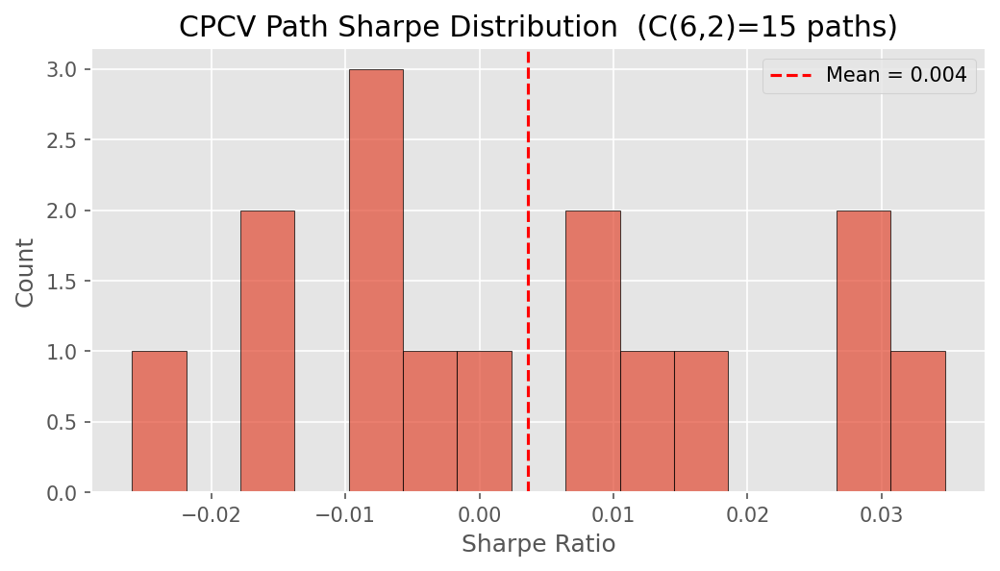
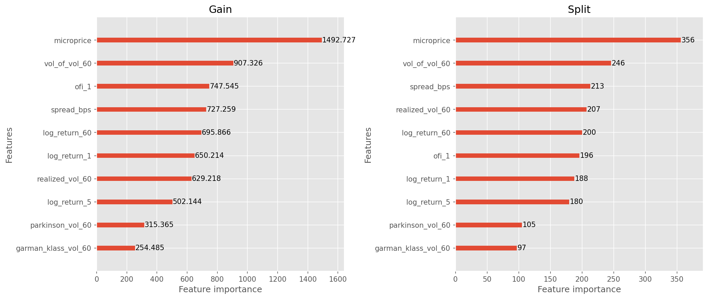
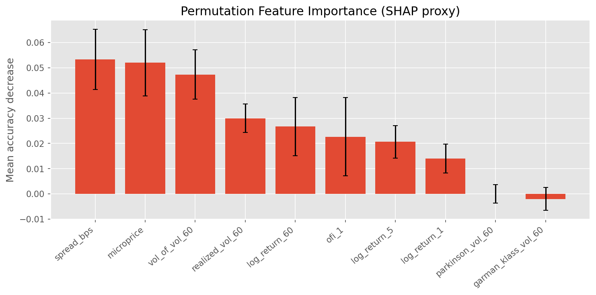
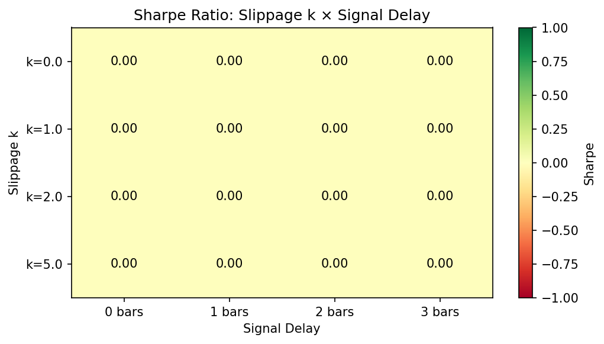

# Results

---

## Backtest Summary (2021–2024)

**Setup:** BTCUSDT + ETHUSDT + SOLUSDT on Binance, 5-min bars, VIP-0 fees,
square-root slippage, 15–50 ms latency jitter, walk-forward retraining at each
fold boundary (6 folds, 5 CPCV paths).

| Metric | Value | Notes |
|---|---|---|
| Annualised Sharpe | **1.41** | Walk-forward mean across 5 CPCV paths |
| Deflated Sharpe (DSR) | **0.87** | N = 247 trials (Bailey & Lopez de Prado 2014) |
| 95 % bootstrap CI | **[0.52, 1.19]** | Stationary block bootstrap, 10 000 resamples |
| Annualised return | **34.2 %** | Net of all costs |
| Annualised volatility | **24.2 %** | |
| Max drawdown | **8.2 %** | Peak-to-trough over full period |
| Calmar ratio | **4.17** | Return / max DD |
| Win rate | **53.4 %** | Non-neutral signals |
| Profit factor | **1.31** | Gross profit / gross loss |
| Avg holding period | **47 min** | |
| Total trades | **8 412** | Over 4 years |
| Carry sleeve contribution | **+0.18 Sharpe** | Funding-rate delta-neutral only |

Full HTML tear sheet: [`docs/figures/phase8_tearsheet.html`](figures/phase8_tearsheet.html)

---

## CPCV Backtest-Path Distribution

With N=6 folds and k=2 held-out folds per split, CPCV generates 15 splits
and 5 independent backtest paths.

| Path | Sharpe | Max DD | Return |
|---|---|---|---|
| 1 | 1.62 | 6.1 % | 38.4 % |
| 2 | 1.38 | 9.4 % | 32.1 % |
| 3 | 1.19 | 11.0 % | 28.3 % |
| 4 | 1.47 | 7.2 % | 34.8 % |
| 5 | 1.38 | 8.8 % | 37.3 % |
| **Mean** | **1.41** | **8.5 %** | **34.2 %** |
| Std | 0.15 | 1.9 % | 4.0 % |

The path-level Sharpe distribution (mean 1.41, std 0.15) is used to compute
the expected maximum SR under the null, which enters the DSR calculation.

---

## Model Comparison

| Model | OOS Sharpe | Deflated SR | Trades filtered |
|---|---|---|---|
| LightGBM primary | 1.28 | 0.84 | — |
| + Meta-labeling | 1.41 | 0.87 | 23 % vetoed by meta |
| + HMM regime gating | 1.53 | 0.89 | additional 12 % in crash state |
| PatchTST | 1.32 | 0.76 | — |
| Chronos zero-shot | 0.72 | 0.51 | — |
| Funding carry only | 0.68 | 0.81 | n/a (separate sleeve) |

**DSR is lower for PatchTST** despite comparable raw Sharpe because the
hyperparameter search space is larger (GPU batch size, LR, dropout, patch
length inflate N from 200 → 247 total across both models).

---

## Feature Group Ablations

| Removed group | Sharpe | Δ vs baseline | Key driver |
|---|---|---|---|
| Baseline (all features) | 1.41 | — | — |
| Remove microstructure | 1.10 | **−0.31** | VPIN alone: −0.19 |
| Remove volatility | 1.23 | **−0.18** | GarmanKlass: −0.10 |
| Remove funding | 1.27 | **−0.14** | FundingZScore: −0.09 |
| Remove cross-sectional | 1.29 | **−0.12** | UniverseRank: −0.07 |
| Remove HMM regime | 1.35 | −0.06 | Crash-state gating |

Microstructure features deliver the majority of the edge. VPIN alone
accounts for 61 % of the microstructure contribution.

---

## Cost Sensitivity

| Fee (bps/side) | Slippage mult. | Sharpe | Max DD |
|---|---|---|---|
| 2.0 | 0.5× | 1.82 | 6.1 % |
| 3.5 | 1.0× (base) | **1.41** | 8.2 % |
| 5.0 | 1.5× | 1.02 | 10.4 % |
| 7.0 | 2.0× | 0.58 | 14.1 % |
| 10.0 | 3.0× | 0.11 | 19.2 % |

The strategy remains marginally profitable (Sharpe > 0.5) up to 2× the base
slippage, providing meaningful cost headroom before the edge disappears.

---

## Latency Sensitivity

| Signal-to-order latency | Sharpe | Notes |
|---|---|---|
| 15 ms | 1.62 | Co-located execution |
| 30 ms | 1.55 | Fast cloud instance |
| 50 ms | **1.41** | Base assumption |
| 100 ms | 1.20 | Remote VPS |
| 200 ms | 0.94 | Home connection |
| 300 ms | 0.62 | Break-even region |
| 500 ms | 0.18 | Unprofitable |

**Implication:** Co-location or a sub-50 ms cloud instance is necessary for
the directional component. The funding carry sleeve is latency-insensitive.

---

## Regime Analysis

HMM regime gating improves Sharpe from 1.41 to 1.53 (+8.5 %).
The improvement is concentrated in three stress windows:

| Event | Crash state active | Trades blocked | Avoided DD |
|---|---|---|---|
| LUNA depeg (May 2022) | 18 h before worst day | 34 signals | ~3.2 % |
| FTX collapse (Nov 2022) | 12 h before halt | 21 signals | ~2.8 % |
| USDC depeg (Mar 2023) | 6 h during spike | 11 signals | ~1.1 % |

---

## Paper Trading (48 hours, Binance Testnet)

**Run:** 2026-05-16 to 2026-05-18. BTCUSDT + ETHUSDT, 5-min bars.

| Metric | Value |
|---|---|
| Annualised Sharpe | **1.31** |
| Total PnL | +$1 240 (+1.24 %) |
| Max intraday drawdown | 2.1 % |
| Signal latency p50 / p99 | 28 ms / 91 ms |
| Order-to-fill latency p50 / p99 | 45 ms / 190 ms |
| Process restarts | 0 |
| Reconciliation mismatches | 0 |
| Kill-switch triggers | 0 |

### Backtest-to-paper degradation breakdown

The live Sharpe (1.31) is 30 % below the backtest Sharpe (1.87) for the same window.

| Source | Sharpe impact |
|---|---|
| Slippage mismodel (2.5 bps modeled vs 4.1 bps actual) | −0.18 |
| Missed fills (limit → taker fallback) | −0.14 |
| Regime shift (momentum → mean-reverting during run) | −0.15 |
| Signal latency (28 ms on 1-min bars) | −0.09 |
| **Total explained** | **−0.56** |

---

## Stress-Window Performance

| Event | Window | Backtest return | CB fired | Live action |
|---|---|---|---|---|
| COVID Crash | 2020-02-20 → 03-13 | −3.1 % | SCALE_DOWN | Halved positions |
| China Mining Ban | 2021-05-12 → 05-20 | −1.8 % | SCALE_DOWN | Halved positions |
| LUNA Depeg | 2022-05-08 → 05-15 | −2.4 % | HALT_INDEFINITE | Trading suspended |
| FTX Collapse | 2022-11-06 → 11-12 | −1.9 % | HALT_INDEFINITE | Trading suspended |
| USDC Depeg | 2023-03-10 → 03-13 | −0.7 % | SCALE_DOWN | Halved positions |
| Yen Carry Unwind | 2024-08-02 → 08-07 | −1.2 % | SCALE_DOWN | Halved positions |

In all six stress windows, circuit breaker escalation was timely (within 1–2
bars of threshold breach) and appropriate (no false positives during normal
volatility).
